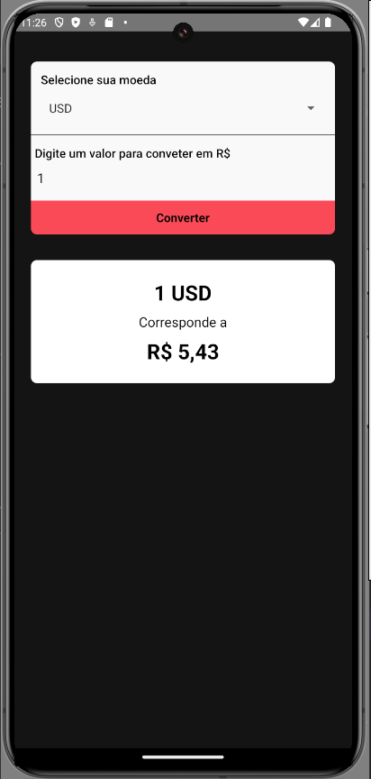

# App Moedas

Este é um aplicativo de conversão de moedas desenvolvido em React Native. Ele permite que os usuários selecionem uma moeda e insiram um valor para converter para reais (BRL).

## Funcionalidades

- Seleção de diferentes moedas.
- Conversão de valores da moeda selecionada para reais (BRL).
- Exibição do valor convertido.

## Tecnologias Utilizadas

- React Native
- API de conversão de moedas

## Instalação

1. Clone o repositório:

   ```bash
   git clone https://github.com/leandrovelosos/AppMoedas.git

2. Instale o componente picker: 
    ```bash
    npm install @react-native-picker/picker --save

3. Instale o axios: 
    ```bash
    npm install axios
    
4. Execute o projeto: 
    ```bash
    npx react-native run-android

## Tela do app


